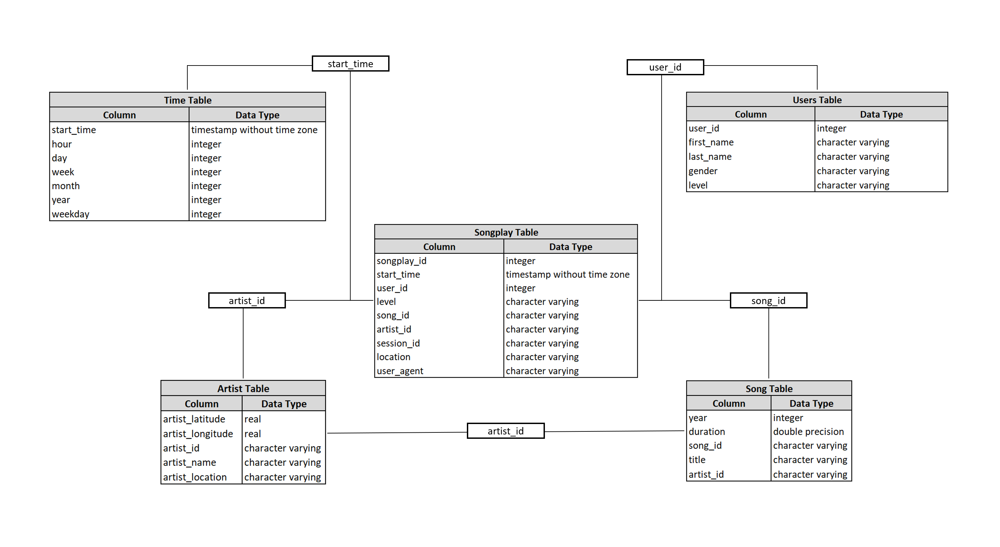

# Sparkify ETL Pipeline PostgreSQL

## Project Description

Skarkify is a startup that wants to analyze song and user activity data that they've been collecting on their streaming app. With this initiative in mind, a PostgreSQL database was developed in addition to an ETL pipeline in Python. 

## How to Run ETL Pipeline

1) Run create_tables.py to drop all existing tables in the Sparkify database and create new tables. This will be the first step to get the ETL pipeline up and running and will only need to be used afterwards if the project needs to start from scratch while in development.
2) Run the test.ipynb Jupyter Notebook to test any ETL pipeline work completed.  
3) With the initial batch of data in the Data folder run the pipeline to extract, transform, and load the data into the Sparkify database.

## Files & Description

* **test.ipynb -**  Using Python's SQL extension, a script is developed to allow for database testing by viewing created tables.
* **create_tables.py -**  Python script is developed to drop and create tables allowing for flexibility during the ETL pipeline development phase.
* **etl.ipynb -** A Jupyter notebook containing the first phase of development for Sparkify's ETL pipeline.
* **etl.py -** Final ETL pipeline script that extracts data from JSON files, transforms the data appropriately to allow for future analysis, and loads the data into Sparkify's database via fact and dimension tables.
* **sql_queries.py -** Contains all SQL queries used in the ETL pipeline.

## Schema - Star

#### Fact Table:
* **songplays -** songplay_id, start_time, user_id, level, song_id, artist_id, session_id, location, user_agent
Dimension Tables

#### Dimension Tables:
* **users -** user_id, first_name, last_name, gender, level
* **songs -** song_id, title, artist_id, year, duration
* **artists -** artist_id, name, location, latitude, longitude
* **time -** start_time, hour, day, week, month, year, weekday

#### Entity Relationships Diagram:

